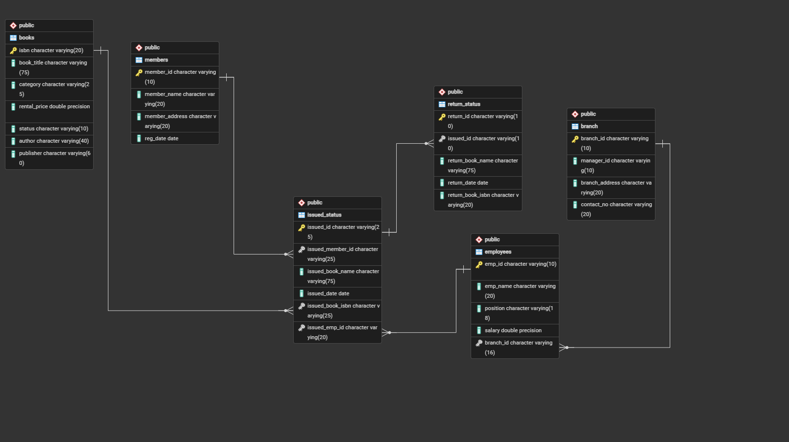

# sql_library_management_analysis_p2
Data Analysis project using SQL

## Project Overview
**Project Title**: Library Management Analysis

This project demonstrates the implementation of a Library Management System using SQL. It includes creating and managing tables, performing CRUD operations, and executing advanced SQL queries. The goal is to showcase skills in database design, manipulation, and querying.

## Objectives
1. **Set up the Library Management System Database**: Create and populate the database with tables for branches, employees, members, books, issued status, and return status.
2. **CRUD Operations**: Perform Create, Read, Update, and Delete operations on the data.
3. **CTAS (Create Table As Select)**: Utilize CTAS to create new tables based on query results.
4. **Advanced SQL Queries**: Develop complex queries to analyze and retrieve specific data.

## Project Structure
### 1. Database Setup


**Database Creation**: Created a database.
**Table Creation**: Created tables for branches, employees, members, books, issued status, and return status. Each table includes relevant columns and relationships.

### 2. CRUD operations
**Create**: Inserted sample records into the `books` table.
**Read**: Retrieved and displayed data from various tables.
**Update**: Updated records in the `employees` table.
**Delete**: Removed records from the `members` table as needed. 

**Task 1. Create a New Book Record:** "978-1-60129-456-2', 'To Kill a Mockingbird', 'Classic', 6.00, 'yes', 'Harper Lee', 'J.B. Lippincott & Co.')"

---
**Task 2. Update an Existing Member's Address**

---
**Task 3. Delete a Record from the Issued Status Table:**
Objective: Delete the record with issued_id = 'IS121' from the issued_status table.

---
**Task 4. Retrieve All Books Issued by a Specific Employee:**
Objective: Select all books issued by the employee with emp_id = 'E101'.

---
**Task 5. List Members Who Have Issued More Than One Book**
Objective: Use GROUP BY to find members who have issued more than one book.

---
### 3. CTAS (Create Table As Select)
**Task 6. Create Summary Tables:** Used CTAS to generate new tables based on query results - each book and total book_issued_cnt

---

### 4. Data Analysis & Findings
The following SQL queries were used to address specific questions:

**Task 7. Retrieve All Books in a Specific Category:**

---
**Task 8. Find Total Rental Income by Category:**

---
**Task 9. List Members Who Registered in the Last 180 Days:**

---
**Task 10. List Employees with Their Branch Manager's Name and their branch details:**

---
**Task 11. Create a Table of Books with Rental Price Above a Certain Threshold:**

---
**Task 12. Retrieve the List of Books Not Yet Returned**

---

## Advanced SQL Operations

**Task 13. Identify Members with Overdue Books**
Write a query to identify members who have overdue books (assume a 30-day return period). Display the member's_id, member's name, book title, issue date, and days overdue.

---
**Task 14. Update Book Status on Return**
Write a query to update the status of books in the books table to "Yes" when they are returned (based on entries in the return_status table).

---
**Task 15. Branch Performance Report**
Create a query that generates a performance report for each branch, showing the number of books issued, the number of books returned, and the total revenue generated from book rentals.

---
**Task 16. CTAS: Create a Table of Active Members**
Use the CREATE TABLE AS (CTAS) statement to create a new table active_members containing members who have issued at least one book in the last 2 months.

---
**Task 17. Find Employees with the Most Book Issues Processed**
Write a query to find the top 3 employees who have processed the most book issues. Display the employee name, number of books processed, and their branch.

---
**Task 18. Stored Procedure Objective:**
Create a stored procedure to manage the status of books in a library system. Description: Write a stored procedure that updates the status of a book in the library based on its issuance. The procedure should function as follows: The stored procedure should take the book_id as an input parameter. The procedure should first check if the book is available (status = 'yes'). If the book is available, it should be issued, and the status in the books table should be updated to 'no'. If the book is not available (status = 'no'), the procedure should return an error message indicating that the book is currently not available.

---
**Task 19. Create Table As Select (CTAS)**
Objective: Create a CTAS (Create Table As Select) query to identify overdue books and calculate fines.
Description: Write a CTAS query to create a new table that lists each member and the books they have issued but not returned within 30 days. The table should include: The number of overdue books. The total fines, with each day's fine calculated at $0.50. The number of books issued by each member. The resulting table should show: Member ID Number of overdue books Total fines

---
## Reports
- **Database Schema**: Detailed table structures and relationships.
- **Data Analysis**: Insights into book categories, employee salaries, member registration trends, and issued books.
- **Summary Reports**: Aggregated data on high-demand books and employee performance.

## Conclusion
This project demonstrates the application of SQL skills in creating and managing a library management system. It includes database setup, data manipulation, and advanced querying, providing a solid foundation for data management and analysis.

## How to use
1. **Clone the Repository:** Clone this repository to your local machine.
```
 git clone https://github.com/sarthakbhatnagar40-30/sql_library_management_analysis_p2.git
```
2. **Set Up the Database:** Execute the SQL scripts in the ERD.sql and importing_data.sql file to create and populate the database.
3. **Run the Queries:** Use the SQL queries in the project_task.sql and advanced_operations.sql file to perform the analysis.
4. **Explore and Modify:** Customize the queries as needed to explore different aspects of the data or answer additional questions.

## Author
- [@sarthakbhatnagar40-30](https://github.com/sarthakbhatnagar40-30)

## 🔗 Links
[](https://www.linkedin.com/in/sarthak-bhatnagar-764470360/)


